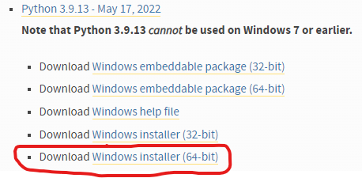
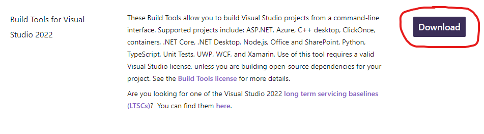

# CS1420 Python Virtual Environment Setup 2026

## Brown CS Department Machine
On Brown CS department machines, the virtual environment is already built and the packages are installed. You can directly activate it and subsequently use it by running the following command from your home directory:
```bash
source /course/cs1420/cs142_env/bin/activate
```
The prompt will then change to begin with `(cs142_env)` to show that the virtual environment is active.

Deactivate the virtual environment when you're done coding with
```bash
deactivate
```
After deactivation, you will notice that `(cs142_env)` disappears from the beginning of the the prompt.

## Personal Mac
### Install Python 3.13
First check whether Python 3.13 is already installed by running
```bash
python3.13 -V
```
Install Python [3.13.11](https://www.python.org/downloads/release/python-31311/) as needed (`macOS 64-bit universal2 installer` for Silicon and `macOS 64-bit Intel-only installer` for Intel).

### Create a Folder for the Course
How you structure your files is up to you, but we recommend making a main course directory to house the Python virtual environment and all the homeworks.  This would look something like the following:
```
cs1420_code/  <--- your course directory
├── env/
├── hw1/
├── hw2/
└── ...
```
Don't worry about creating any of the subdirectories yet; we are about to create the `env/` directory, and homework directories will be created as you do the homeworks throughout the semester.

### Create the virtual environment
You only need to do this once during setup. Afterwards, you can directly activate the virtual environment with the next step.

To create the virtual environment, navigate to your course directory that will contain all your cs1420 projects (`cs1420_code/` in the example file structure above), and run
```bash
python3.13 -m venv env
```
to create a directory `env/` that houses our virtual environment.

### Activate the Virtual Environment
From your course directory, run
```bash
source env/bin/activate
```
After activation, the prompt will change to begin with `(env)` to show that the virtual environment is active.

While the virtual environment is active, you can call `python3.13` directly with `python` because that is the only python version that is linked in the virtual environment.

### Installing required cs1420 packages with pip
Download the file `requirements.txt` from this repository and move it to you course directory.

With the virtual environment active from the previous step and still in your course folder, use the following command to install the requried packages from pip.  This only needs to be done once during setup.
```bash
# optional: update the essential packages
pip3 install -U pip wheel setuptools
# essential: install all CS1420 dependencies
pip3 install -r requirements.txt
```

### Deactivating the virtual environment
Just run
```bash
deactivate
```
from anywhere.

After deactivation, you will notice that `(env)` disappears from the beginning of the the prompt.

## Personal Windows
### Install Python 3.13
First check whether Python 3.13 is already installed by running
```
py -3.13
```
in command prompt or powershell and making sure there is no error.

If you need to install Python 3.13, go <a href="https://www.python.org/downloads/windows/">here</a> and download and run the 64-bit Windows installer for Python 3.13.11:



### Install Microsoft's Build Tools for Visual Studio
This installation is necessary for some of the packages we use for the course.

Visit <a href="https://visualstudio.microsoft.com/downloads/">Microsoft's site</a> and scroll down to the 'All Downloads' section.

Expand the 'Tools for Visual Studio' submenu and download 'Build Tools for Visual Studio 2022'.



Finally, run the _vs_BuildTools.exe_ executable and follow the prompts

### Create a folder for the course
How you structure your files is up to you, but we recommend making a main course directory to house the Python virtual environment and all the homeworks.  This would look something like the following:
```
cs1420_code/  <--- your course directory
├── env/
├── hw1/
├── hw2/
└── ...
```
Don't worry about creating any of the subdirectories yet; we are about to create the `env/` directory, and homework directories will be created as you do the homeworks throughout the semester.

### Create the virtual environment
You only need to do this once during setup. Afterwards, you can directly activate the virtual environment with the next step.

To create the virtual environment, navigate to your course directory that will contain all your cs1420 projects (`cs1420_code/` in the example file structure above), and run
```
py -3.13 -m venv env
```
to create a directory `env/` that houses our virtual environment.

### Activate the virtual environment
From your course directory, run
```
.\env\Scripts\activate
```
After activation, the prompt will change to begin with `(env)` to show that the virtual environment is active.

While the virtual environment is active, you can call `python3.13` directly with `python` because that is the only python version that is linked in the virtual environment.

### Installing required cs1420 packages with pip
Download the file `requirements.txt` from this repository and move it to you course directory.

With the virtual environment active from the previous step and still in your course folder, use the following command to install the requried packages from pip.  This only needs to be done once during setup.
```bash
pip3 install -r requirements.txt
```

### Deactivating the virtual environment
Just run
```bash
deactivate
```
from anywhere.

After deactivation, you will notice that `(env)` disappears from the beginning of the the prompt.
